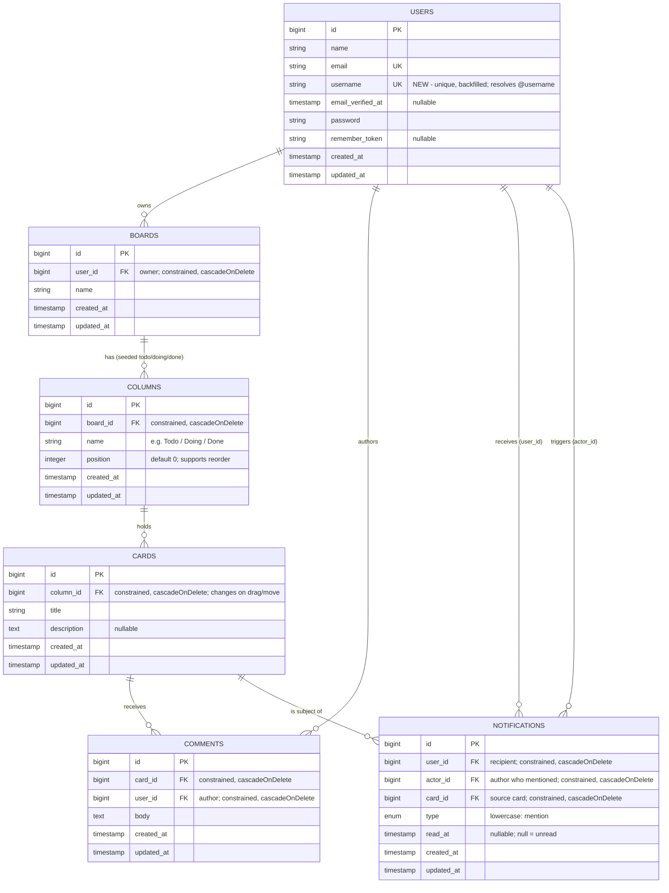
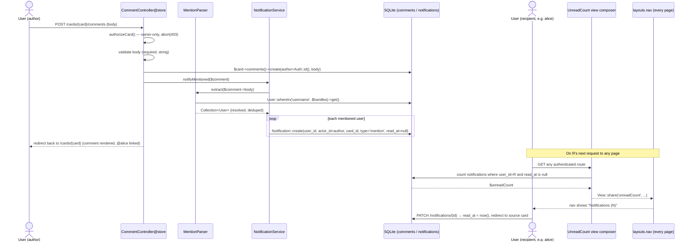

# Architecture — Kanban Board with Comments & @Mention Notifications

This document specifies the technical design for the Track 1 feature layered on the Laravel `Task` starter: a single-user Kanban board (**Board → Column → Card**) with per-card **Comment** threads and `@mention` **Notifications**. It is coherent with `docs/plan.md` (the locked implementation plan), `design/design-brief.md` (routes, wireframes, flows), and the existing starter code (`TaskController`, `Task`/`User` models, `routes/web.php`, the `tasks` migration).

Guiding constraints carried over from the starter and the plan:

- **Stack:** PHP 8.5, Laravel 12 (streamlined structure — middleware/routing wired in `bootstrap/app.php`), PHPUnit 11, SQLite, hand-rolled session auth, plain Blade + Tailwind (CDN). No Filament/Livewire, no npm build.
- **Schema conventions mirror `tasks`:** every child references its parent with `foreignId(...)->constrained()->cascadeOnDelete()`, all tables carry `timestamps()`, and any status-/type-like column uses a **lowercase** enum (as `status` does with `todo|doing|done`).
- **Ownership scoping is the security model.** Every read and write is constrained to the authenticated user, mirroring `TaskController::authorizeTask()`, which `abort(403)`s when `$task->user_id !== Auth::id()`.

---

## 1. Data model

The feature adds five tables (`boards`, `columns`, `cards`, `comments`, `notifications`) and one column to `users` (`username`). Ownership is not stored on every row; it is **derived by traversing the relationship chain** `Card → Column → Board → user_id`. Only `Board` holds the owning `user_id`, which keeps the security model single-sourced (a card cannot disagree with its board about who owns it).

**Notes and rationale**

- **`username` on `users`.** The starter only ships `name`/`email`; neither is a safe, space-free handle to resolve `@alice` against (`name` may contain spaces/duplicates, `email` collides with the `x@alice.com` false-match case). The plan adds a **unique** `username` column (backfilled, then required at registration and via `UserFactory`), and the seeder creates a second user `alice`. Mentions resolve strictly against this column.
- **`Card` has no `assignee` column.** Boards are single-user, so the "@me" shown in the wireframes is the board owner derived through the ownership chain, not a stored foreign key. This keeps the card schema to the plan's `title` / `description` / `column_id`.
- **Cards order by `created_at`** (Flow A: a new card "appears at the bottom of that column"). `columns.position` exists to back the `PATCH /columns/{column}` "reorder" affordance in the route table.
- **Explicit `notifications` domain table**, deliberately *not* Laravel's polymorphic `notifications`/`Notifiable` table (tradeoff #1 below). `type` is a lowercase enum (`mention`) to match the `status` casing convention, extensible to future kinds (e.g. `comment`, `assignment`). `read_at IS NULL` is the single source of truth for "unread"; the two distinct FKs to `users` (`user_id` recipient, `actor_id` author) let the feed render "@actor mentioned you."
- **`cascadeOnDelete` throughout** means deleting a board tears down its columns → cards → comments and any notifications referencing those cards, exactly like `tasks` cascades from `users`.

Eloquent relationships to declare: `User hasMany Board`, `User hasMany Comment`, `User hasMany Notification` (recipient); `Board belongsTo User` / `hasMany Column`; `Column belongsTo Board` / `hasMany Card`; `Card belongsTo Column` / `hasMany Comment` / `hasMany Notification`; `Comment belongsTo Card`, `Comment belongsTo User`; `Notification belongsTo User` (recipient), `belongsTo User as actor`, `belongsTo Card`.

---

## 2. API / route endpoints

All routes live inside the existing `Route::middleware('auth')->group(...)` in `routes/web.php` (guests are bounced to `/login` by the `auth` middleware). Boards use `Route::resource`; nested and shallow routes are declared explicitly. The **Auth** column notes both the middleware and the ownership guard, which resolves the target back to its owning board and `abort(403)` on mismatch — the same shape as `authorizeTask()`.

| Method | Path | Purpose | Auth |
| --- | --- | --- | --- |
| GET | `/boards` | List the current user's boards (`boards.index`) | `auth`; query scoped to `Auth::user()->boards()` |
| GET | `/boards/create` | New-board form (`boards.create`) | `auth` |
| POST | `/boards` | Create board + seed three columns (Todo/Doing/Done) | `auth`; created via `Auth::user()->boards()->create()` |
| GET | `/boards/{board}` | Board view: columns + cards (`boards.show`) | `auth`; `authorizeBoard()` owner-only 403 |
| PATCH | `/boards/{board}` | Rename board | `auth`; `authorizeBoard()` owner-only 403 |
| DELETE | `/boards/{board}` | Delete board (cascades columns/cards/comments) | `auth`; `authorizeBoard()` owner-only 403 |
| POST | `/boards/{board}/columns` | Add a column to the board | `auth`; `authorizeBoard()` owner-only 403 |
| PATCH | `/columns/{column}` | Rename / reorder column (`position`) | `auth`; `authorizeColumn()` via `column→board→user_id`, 403 |
| DELETE | `/columns/{column}` | Delete column (cascades cards) | `auth`; `authorizeColumn()` 403 |
| POST | `/columns/{column}/cards` | Create card in column | `auth`; `authorizeColumn()` 403; created via `$column->cards()->create()` |
| GET | `/cards/{card}` | Card detail + comment thread (`cards.show`) | `auth`; `authorizeCard()` via `card→column→board→user_id`, 403 |
| PATCH | `/cards/{card}` | Edit card **or move column** (drag → new `column_id`) | `auth`; `authorizeCard()` 403; target `column_id` validated to belong to the same owned board |
| DELETE | `/cards/{card}` | Delete card (cascades comments) | `auth`; `authorizeCard()` 403 |
| POST | `/cards/{card}/comments` | Post comment; parses `@mentions`, fans out notifications | `auth`; `authorizeCard()` 403; comment author = `Auth::id()` |
| GET | `/notifications` | Notifications feed, unread first (`notifications.index`) | `auth`; scoped to `Auth::user()->notifications()` |
| PATCH | `/notifications/{notification}` | Mark one read (`read_at = now()`), redirect to source card | `auth`; owner-only — 403 unless `notification->user_id === Auth::id()` |
| GET | `/users/{username}` | Placeholder profile so mention links resolve (`users.show`) | `auth`; route-model-bound on `username` |

The **card move** is a single `PATCH /cards/{card}` that updates `column_id` (tradeoff #2). Validating that the target column belongs to the same owned board prevents cross-board moves even though the card ownership check already passed.

---

## 3. State flow: comment → mention → notification → unread feed → nav badge

This is the feature's spine and covers Flows B and C from the design brief. Two collaborators sit behind the controller: a pure `MentionParser` (unit-tested — TDD target #1) and a `NotificationService` that performs the fan-out (feature-tested — TDD target #2). The nav badge is delivered on **every** page by a shared **view composer**, so no individual controller has to remember to pass the count.

**Concretely, step by step:**

1. **Comment posted.** `CommentController@store` runs `authorizeCard($card)` (traverses `card → column → board → user_id`, `abort(403)` on mismatch), validates `body`, then writes the row through the ownership-scoped relationship: `$card->comments()->create(['user_id' => Auth::id(), 'body' => $data['body']])`.
2. **Mention parsed.** The controller hands the saved `$comment` to `NotificationService::notifyMentioned()`, which calls `MentionParser::extract($comment->body)`. The parser is **pure**: a regex pulls `@handle` tokens while (per the TDD edge cases) deduping repeats, matching case-insensitively, honoring punctuation boundaries (`@alice,`), rejecting in-email matches (`x@alice.com`), and silently dropping unknown handles. It resolves survivors via `User::whereIn('username', $handles)` and returns only matched `User` models.
3. **Notification created.** For each resolved user, `NotificationService` inserts one `Notification` row (`user_id` = recipient, `actor_id` = comment author, `card_id` = the card, `type = 'mention'`, `read_at = null`). Unknown handles produce zero rows and never raise — the acceptance criterion for Flow B. Self-mentions follow the same path (no special-casing), a behavior the parser's tests pin down.
4. **Feed shows unread.** `NotificationController@index` loads `Auth::user()->notifications()` ordered **unread first, then most recent** (e.g. `orderByRaw('read_at is null desc')->latest()`), eager-loading `actor` and `card` so `notifications.index` can render "@alice mentioned you on '{card title}'" with the ● unread marker (Wireframe 3).
5. **Nav badge on every page.** A **shared view composer** bound to `layouts.nav` (registered in `AppServiceProvider`) computes `$unreadCount = Auth::user()->notifications()->whereNull('read_at')->count()` for the authenticated user and shares it into the nav on every render — so the "Notifications (N)" badge stays correct site-wide without each controller passing it.
6. **Mark read.** Clicking a feed row issues `PATCH /notifications/{notification}`, which 403s unless the row belongs to the current user, sets `read_at = now()`, and redirects to the source card `/cards/{card}`. On the next page render the composer recomputes a lower count, so the badge decrements (Flow C acceptance).

---

## 4. Design tradeoffs

### Tradeoff A — Explicit `notifications` domain table vs. Laravel's `Notifiable`/`notifications` system

**Options.** (1) Reuse Laravel's built-in notifications: keep the `Notifiable` trait already on `User`, run `php artisan notifications:table`, and dispatch `Notification` classes into the polymorphic `notifications` table (UUID id, morph target, JSON `data`, `read_at`). (2) Build a first-class `notifications` domain table with typed integer columns (`user_id`, `actor_id`, `card_id`, `type`, `read_at`).

**Decision.** Build the explicit domain table (option 2).

**Reasoning.** The feature treats a notification as a **queryable domain entity**, not an opaque delivery record. The unread-first feed, the site-wide unread count, and "@actor mentioned you on {card}" all want to filter and join on real columns (`WHERE read_at IS NULL`, join `card_id`, join `actor_id`) — cheap with typed FKs, awkward against a JSON `data` blob and a polymorphic morph. Explicit `foreignId(...)->cascadeOnDelete()` also lets deletions cascade naturally (delete a card → its notifications vanish), which the framework's generic table does not model. It keeps the lowercase-`type` enum convention consistent with the rest of the schema and makes the three TDD targets assert against plain, obvious rows. The cost — we forgo Laravel's mail/broadcast channels and write a tiny `NotificationService` ourselves — is negligible here (in-app only, one `type`), and the manual project CLAUDE.md explicitly calls for a real domain model. `Notifiable` stays on `User` harmlessly but goes unused.

### Tradeoff B — Card move via async `PATCH` vs. a no-JS form fallback

**Options.** (1) Pure drag-and-drop: HTML5 `dragstart`/`drop` handlers fire a `fetch` `PATCH /cards/{card}` with the CSRF token, updating the DOM optimistically. (2) No-JS only: each card carries a "Move to column" `<select>` (or the card-edit form sets `column_id`) that submits a normal form POST/PATCH and re-renders the board. (3) Both: drag/drop as the primary UX **and** a form fallback, with the server endpoint as the single source of truth.

**Decision.** Option 3 — the async `PATCH` is the primary interaction, but the same endpoint is reachable via a plain form fallback, and a **feature test drives the endpoint directly**, independent of any JavaScript.

**Reasoning.** The graded acceptance criterion (design brief; plan Step 5, the flagged riskiest step) is **server-side persistence of the move**, not animation quality. Browser drag/drop is the most brittle, hardest-to-verify piece: `dragstart`/`drop` wiring, CSRF on the async request, cross-browser quirks. Betting solely on it (option 1) risks failing the graded check for a UX reason; going no-JS only (option 2) satisfies grading but abandons the specified drag interaction. Making the `PATCH` endpoint the source of truth decouples correctness from the UI: the feature test posts `column_id` and asserts the card moved (and that a cross-board or unowned target is rejected), so grading passes even if the drag polish is rough, while the form fallback keeps the board usable without JavaScript. Per the plan, if time runs short the drag animation is the expendable slack — the endpoint and its test stay. This also fits the starter's zero-build constraint: the drag script is a few lines of vanilla JS reading the existing `<meta name="csrf-token">`, with no bundler.
